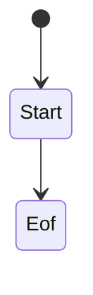

# CueParser
A minimal and precise Go parser for .cue files, powered by a state machine for reliable and readable structured text processing.

## Tokenizer state machine

```mermaid
stateDiagram-v2
    [*] --> Start
    Start --> Eof
```
